# Agent Execute

**Agent Execute** is a working agentic checkout that lets an LLM decide commerce actions while deterministic software controls the payment boundary.

> **The AI can choose what to buy. It can never choose what Razorpay charges.**

Core invariant:

```text
SEEN = COMMITTED = APPROVED = CHARGED
```

The merchant catalog is a hackathon test merchant; the agent loop, MCP calls, mutable merchant state, quote commitment, approval/grant chain, Execution Guard, Razorpay Test Order creation, Test Checkout, payment signature verification, persistent state, and audit trail are real code paths.

## Architecture

```mermaid
flowchart LR
    U[User] --> A[LLM shopping agent]
    A -->|structured tool calls| C[MCP client]
    C --> M[Merchant MCP server]
    M --> S[Mutable merchant state]
    S --> Q[Signed immutable quote<br/>SHA-256 + Ed25519 + expiry + nonce]
    Q --> P[Explicit user approval]
    P --> G[Server execution grant<br/>grant_id only]
    G --> E[Execution Guard<br/>deterministic · zero LLM]
    E -->|verified quote amount only| R[Razorpay Test Order]
    R --> X[Razorpay Test Checkout]
    X --> V[Server-side signature verification]

    A -. no payment amount authority .-> E
```



The authority split is deliberate: the LLM can decide **commerce actions**, but it cannot create approval, alter the signed quote, set a payment amount, or call Razorpay directly.

`execute_payment` has exactly one authority-bearing input:

```json
{ "grant_id": "grant_..." }
```

There is deliberately **no amount argument**. The guard reloads the persisted grant, approval, signed quote, and current merchant cart; it then derives the Razorpay amount only from the verified quote.

## What is real

- API-based LLM with native structured tool calls
- model-generated shopping/recovery sequence
- MCP v2 client/server transport
- server-side catalog, inventory, pricing, discounts, delivery fees and carts
- persistent Neon/Postgres state in deployment
- local SQLite state for zero-setup development/tests
- cart revisioning on financially meaningful changes
- canonical cart serialization + SHA-256 commitment
- Ed25519 merchant signature and verification
- quote expiry and nonce replay protection
- trusted user approval bound to the exact quote
- execution grants persisted in the authoritative database
- deterministic Execution Guard with no LLM access
- idempotent Razorpay Order creation boundary
- real Razorpay Test Mode Order API adapter
- real Razorpay Checkout browser integration
- server-side Razorpay checkout signature verification
- payment-rail failure separated from quote-integrity failure
- persistent agent sessions / structured task state
- append-only audit events
- merchant/judge mutation controls against the same state MCP reads

## MCP transports

Agent Execute uses the MCP SDK in both environments:

- **Local SQLite development:** MCP runs as a separate stdio process.
- **Neon/Vercel:** the MCP client and MCP server use the SDK's linked in-memory transport inside the function. Tool discovery and `callTool` still go through MCP; no direct tool-function shortcut is used.

The transport changes for the deployment runtime, not the agent/tool boundary.

## Run locally

Requirements: **Node.js 22.x**, an LLM API key, and Razorpay **Test Mode** credentials.

```bash
git clone https://github.com/Officially-aditya/Agent-Execute.git
cd Agent-Execute
cp .env.example .env
# fill LLM_API_KEY, RAZORPAY_KEY_ID and RAZORPAY_KEY_SECRET
npm install
npm run setup
npm run dev
```

Open `http://localhost:3001`.

The default `.env.example` preconfigures the Google AI Studio model and OpenAI-compatible base URL with `gemini-3.8-flash`; supply your own LLM API key and Razorpay Test Mode credentials. If you use a different compatible provider/model, change `LLM_MODEL` and `LLM_BASE_URL` accordingly.

By default local development uses SQLite. The agent/web service also exposes the Judge Mode merchant-admin routes, so a second service is not required for the normal development flow. The merchant MCP is spawned over real stdio MCP and is independently runnable with `npm run dev:mcp`.

If `DATABASE_URL` or `NEON_DATABASE_URL` is a PostgreSQL Neon URL, local development uses Neon and the in-memory MCP transport instead.

### Docker

```bash
cp .env.example .env
# fill credentials
docker compose up --build
```

The existing Docker setup remains available for local/container judging. With the default `.env.example`, it uses persistent SQLite storage; with a Neon PostgreSQL URL it uses Neon.

## Deploy to Vercel with Neon

The repository includes a Vercel-recognized Express entrypoint at `src/index.ts`, `vercel.json`, a Vercel build step, and a Neon-backed persistent repository. Do **not** use an ephemeral SQLite path on Vercel.

### 1. Create/connect Neon

Create a Neon database and copy its PostgreSQL connection string. Add it to the Vercel project as either:

```env
DATABASE_URL=postgresql://...
```

or:

```env
NEON_DATABASE_URL=postgresql://...
```

The schema and test catalog are created/seeding idempotently when the Neon-backed application starts.

### 2. Add LLM and Razorpay variables

For Google AI Studio through Google's OpenAI-compatible endpoint:

```env
LLM_API_KEY=...
LLM_MODEL=gemini-3.8-flash
LLM_BASE_URL=https://generativelanguage.googleapis.com/v1beta/openai/

RAZORPAY_KEY_ID=rzp_test_...
RAZORPAY_KEY_SECRET=...
```

Keep all of these server-side.

### 3. Add persistent merchant signing keys

Vercel must not generate merchant signing keys on its filesystem. Generate the key pair once locally:

```bash
npm install
npm run setup
```

Then add the complete contents of these local files to Vercel environment variables:

```text
.data/merchant-private.pem → MERCHANT_SIGNING_PRIVATE_KEY
.data/merchant-public.pem  → MERCHANT_SIGNING_PUBLIC_KEY
```

Include the PEM header/footer. Never commit the keys.

### 4. Vercel project settings

- **Root Directory:** repository root
- allow `vercel.json` to provide the build command
- do not set a custom Output Directory override
- redeploy after adding/changing environment variables

`npm run vercel-build` typechecks the project and copies `apps/web/public` to the root `public/` directory that Vercel serves as static assets. API traffic is handled by the exported Express app.

Judge Mode uses same-origin `/api/admin/*` routes in deployment, backed by the same Neon database used by MCP and the Execution Guard.

## Judge flow

1. Enter any supported request, e.g. `Buy milk, eggs and cereal under ₹500.`
2. Watch the model discover and invoke live MCP tools.
3. Inspect the real cart and committed quote.
4. Approve the exact quote in the UI.
5. Before execution, optionally use **Judge mode → Merchant** to change a price, stock, discount, or delivery fee.
6. Continue the same session. If the quote changed, Execution Guard returns `QUOTE_CHANGED` **before Razorpay** and the same LLM dynamically recovers through MCP.
7. Approve the fresh quote.
8. Guard verifies it and creates a real Razorpay Test Order.
9. Open Razorpay Test Checkout and complete success/failure testing.
10. Inspect the full audit trail.

There are no `/run-demo`, `scenarioId`, hardcoded product sequences, or forced recovery products. The recorded Buildathon demo is one normal invocation of the same code path a judge can run with a different request.

For the suggested 5-minute recording sequence, see [`docs/demo-script.md`](docs/demo-script.md). For a clone-and-test checklist, see [`docs/judge-guide.md`](docs/judge-guide.md).

## Security rules

The LLM may search, compare, choose products, mutate carts, refresh state, commit quotes, recover from stale state, and call `execute_payment(grant_id)`.

It may **not** create approvals, set a payment amount, forge or edit a quote, override signatures/expiry/replay checks, access Razorpay credentials, or call Razorpay directly.

See [docs/threat-model.md](docs/threat-model.md) and [docs/architecture.md](docs/architecture.md).

## Tests

```bash
npm run typecheck
npm test
```

Deployment artifact validation:

```bash
npm run vercel-build
```

Credential-gated real integration checks:

```bash
npm run test:live:llm
npm run test:live:razorpay
```

Coverage targets include:

- one-paise/cart mutation invalidates the commitment
- changed merchant state never reaches the payment rail
- tampered approval amount/signature is blocked
- amount is derived from verified quote only
- duplicate execution cannot duplicate orders
- payment-rail failure is retryable only after integrity verification
- quote/grant nonce replay protection

## Independent MCP inspection

```bash
npm run dev:mcp
```

Or connect a generic MCP inspector/client to:

```bash
npx tsx apps/merchant-mcp/src/index.ts
```

## Environment

See `.env.example`. Secrets stay server-side; browser JavaScript receives only the public Razorpay Test key ID.
